# Top 10 Most-Improved Test Images — RAW vs ENHANCED vs REFERENCE

Visual + numeric comparison of the ten test images that gained the most from
`enhancement_model.py` (feature-guided underwater image enhancement).

Each strip shows three panels, with SSIM and PSNR in large text underneath each panel.
The RAW and ENHANCED values are both measured **against the REFERENCE image**, so they can
be read directly as "before" and "after".

| Panel | Source |
|---|---|
| **RAW** | `dataset/raw-890/<name>` — what the model was given |
| **ENHANCED** | `enhancement_results/enhanced_test_images/<name>` — the model's 256×256 output |
| **REFERENCE** | `dataset/reference-890/<name>` — the target / ground truth |

---

## Top 5 most improved

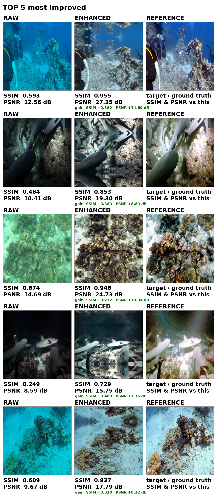

| # | Image | SSIM raw → enhanced | SSIM gain | PSNR raw → enhanced (dB) | PSNR gain |
|---|-------|---------------------|-----------|--------------------------|-----------|
| 1 | `7916.png` | 0.593 → **0.955** | **+0.362** | 12.56 → **27.25** | **+14.69** |
| 2 | `12299.png` | 0.464 → **0.853** | **+0.389** | 10.41 → 19.30 | +8.89 |
| 3 | `595_img_.png` | 0.674 → **0.946** | +0.272 | 14.69 → 24.73 | +10.04 |
| 4 | `12290.png` | 0.249 → **0.729** | **+0.480** (largest) | 8.59 → 15.75 | +7.16 |
| 5 | `7654.png` | 0.609 → **0.937** | +0.328 | 9.67 → 17.79 | +8.12 |

### 1. `7916.png` — best overall

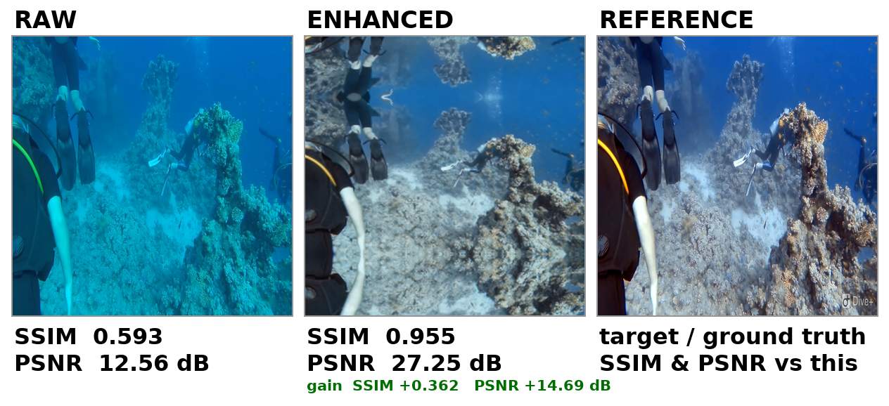

Deep blue/cyan cast removed (red-to-blue mean ratio 0.02 → 0.73), contrast roughly doubles
(21.8 → 45.6); reef and divers become clearly visible. Closest match to the reference of the
whole test set.

### 2. `12299.png` — darkest scene recovered

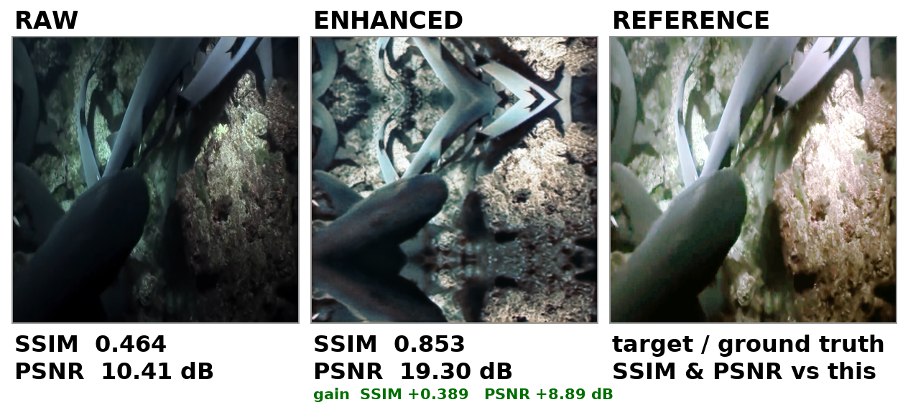

Near-black shark/reef frame. Illumination and local detail restored, shark bodies get clean
edges, substrate texture reappears. Still slightly cooler/bluer than the reference.

### 3. `595_img_.png` — worst haze removed

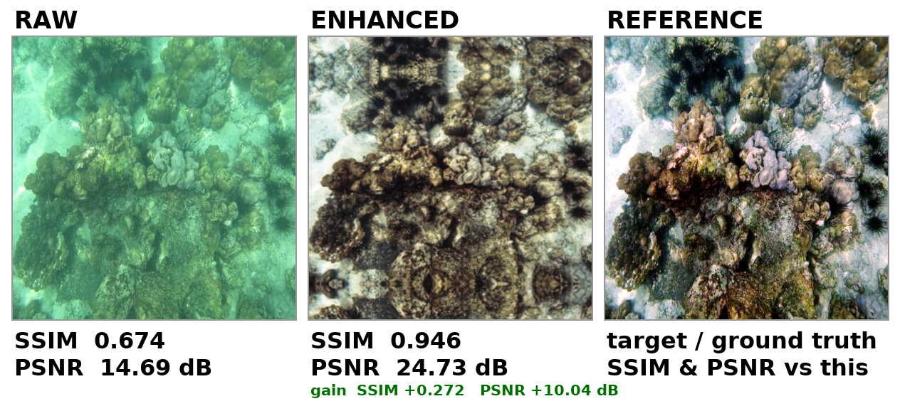

Heavy green water haze stripped out, coral structure and bright sand clearly separated
(contrast 32.7 → 60.5, entropy → 7.77). More neutral/greyer than the vivid reference, but
structurally a very strong match.

### 4. `12290.png` — biggest relative jump

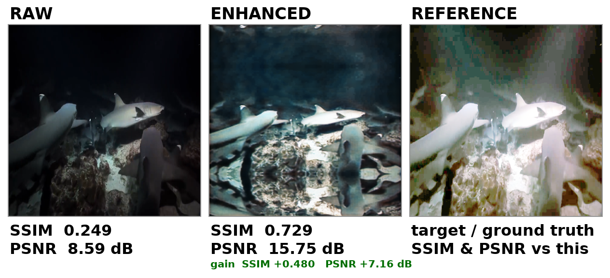

Largest SSIM gain of the set (+0.480). Almost-black scene: shark silhouettes, bubbles and rock
floor become visible. Caveat: still darker and less saturated than the reference, so this is a
*partial* enhancement.

### 5. `7654.png` — colour cast removed

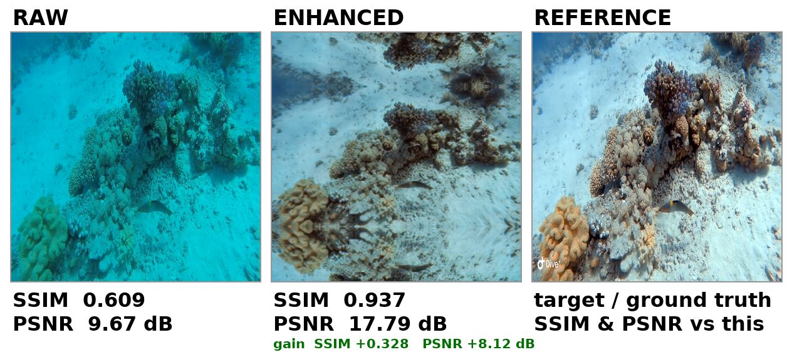

Strong turquoise/cyan cast removed (red-to-blue ratio 0.04 → 0.81), sand-versus-coral
separation restored. Faint checkerboard texture visible in flat areas (CNN artifact).

---

## Ranks 6–10 most improved

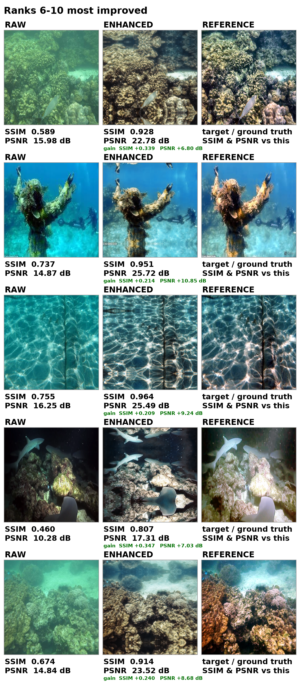

| # | Image | SSIM raw → enhanced | SSIM gain | PSNR raw → enhanced (dB) | PSNR gain |
|---|-------|---------------------|-----------|--------------------------|-----------|
| 6  | `637_img_.png` | 0.589 → **0.928** | +0.339 | 15.98 → 22.78 | +6.80 |
| 7  | `326_img_.png` | 0.737 → **0.951** | +0.214 | 14.87 → **25.72** | **+10.85** |
| 8  | `552_img_.png` | 0.755 → **0.964** | +0.209 | 16.25 → **25.49** | +9.24 |
| 9  | `12324.png`   | 0.460 → **0.807** | +0.347 | 10.28 → 17.31 | +7.03 |
| 10 | `605_img_.png` | 0.674 → **0.914** | +0.240 | 14.84 → 23.52 | +8.68 |

### 6. `637_img_.png`

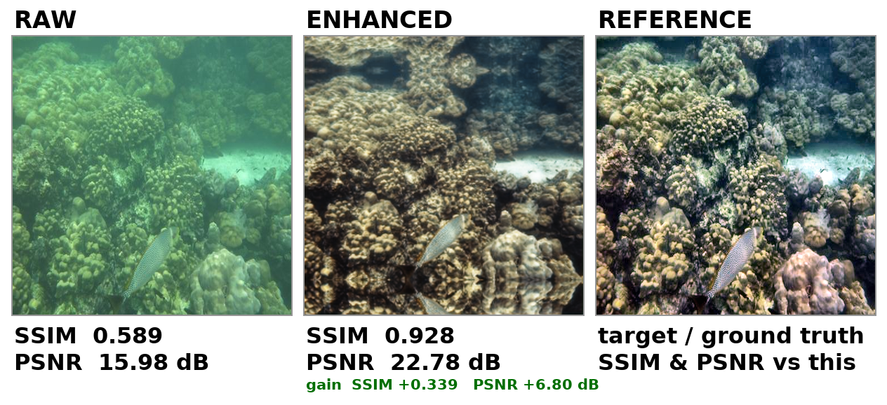

Green haze removed, coral heads and the fish regain structure (contrast 26.7 → 52.7).

### 7. `326_img_.png` — strongest PSNR recovery

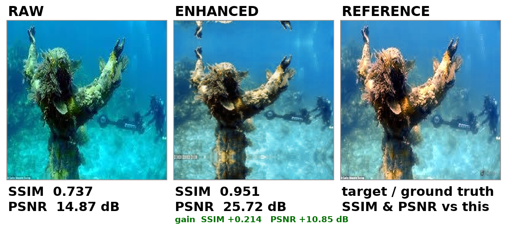

Blue-dominant statue frame; the statue regains its orange/brown colour (red-to-blue ratio
0.15 → 0.57) and the embedded diver in the background becomes visible. Best PSNR gain of the
set (+10.85 dB).

### 8. `552_img_.png` — highest SSIM of all

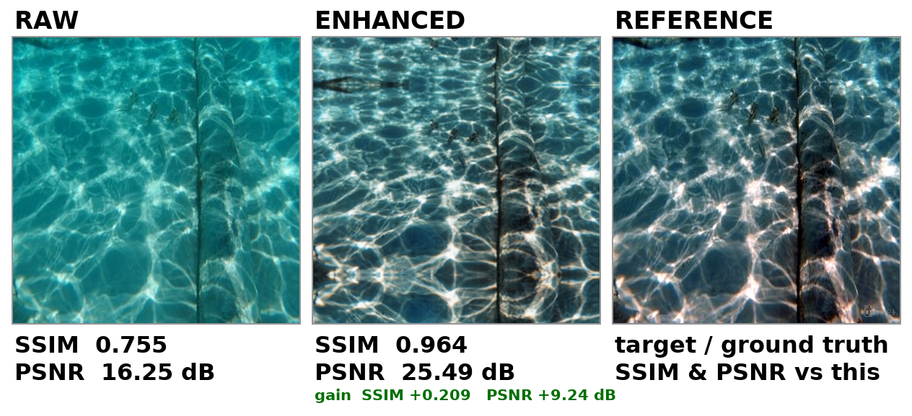

Water-surface shot with a rope: caustic pattern and rope become crisp (SSIM 0.964 — the
highest in the entire test set). Note the model desaturates the teal water noticeably.

### 9. `12324.png`

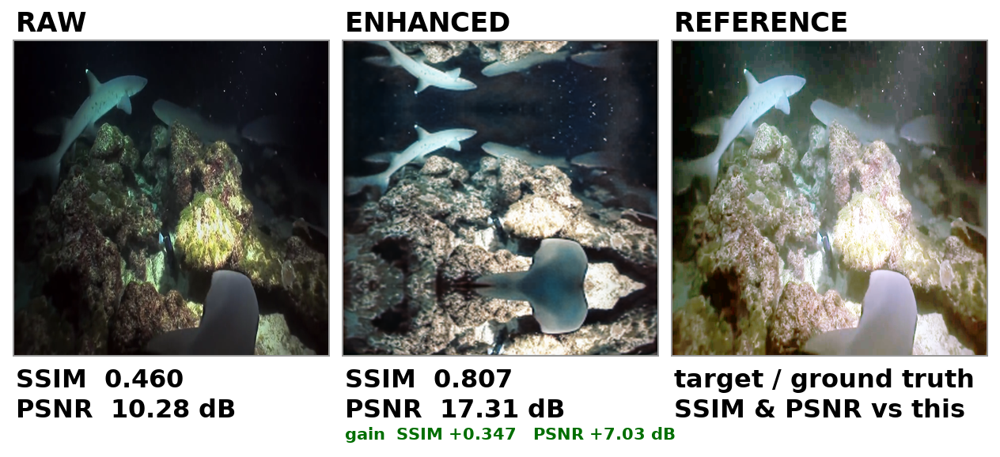

Dim ray/shark scene brightened; animals and the reef floor separate clearly (contrast
42.6 → 66.4, entropy 6.70 → 7.59).

### 10. `605_img_.png`

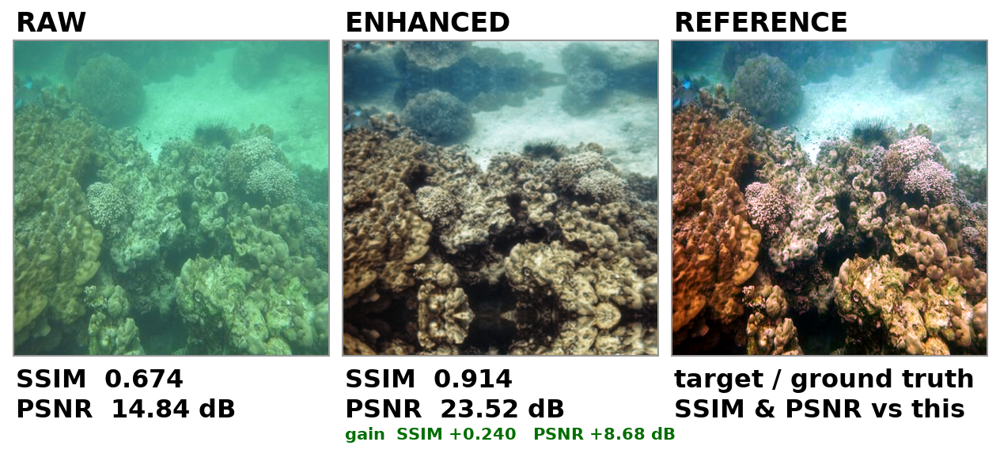

Green cast over a coral slope removed, sand and coral structure recovered (contrast
31.9 → 57.6). Reference is noticeably more colourful than the output.

---

## Context for the whole test set (134 images)

* Mean SSIM vs reference: **0.772 (raw) → 0.886 (enhanced)**
* Mean PSNR vs reference: **17.63 dB → 21.32 dB**
* Improved in SSIM: 109/134 images; improved in PSNR: 112/134 images

### Known weakness

The model reliably fixes **contrast, illumination and colour cast**, but tends to
**desaturate**: 24 of 134 outputs lost more than half their HSV saturation, and 13 lost
significant colourfulness — which is why several enhanced images look washed out next to the
vivid references (visible in `552_img_.png`, `605_img_.png`, `326_img_.png` above).

---

## Method / how these numbers were produced

* Both the raw input and the enhanced output were compared against the reference after the
  same preprocessing used by `enhancement_model.py`: aspect-preserving resize with
  `cv2.INTER_AREA` to 256 px on the long side, then reflect padding to 256×256.
* SSIM and PSNR use `skimage.metrics.structural_similarity` /
  `peak_signal_noise_ratio` with `data_range=255`, identical to the script, and reproduce
  `enhancement_results/enhancement_test_metrics.csv` exactly.
* Contrast = standard deviation of the grayscale image; entropy = Shannon entropy of the
  grayscale histogram; saturation = mean of the HSV S channel.

The strips in `images/` are generated from the repository files listed above; no image data
was modified.
