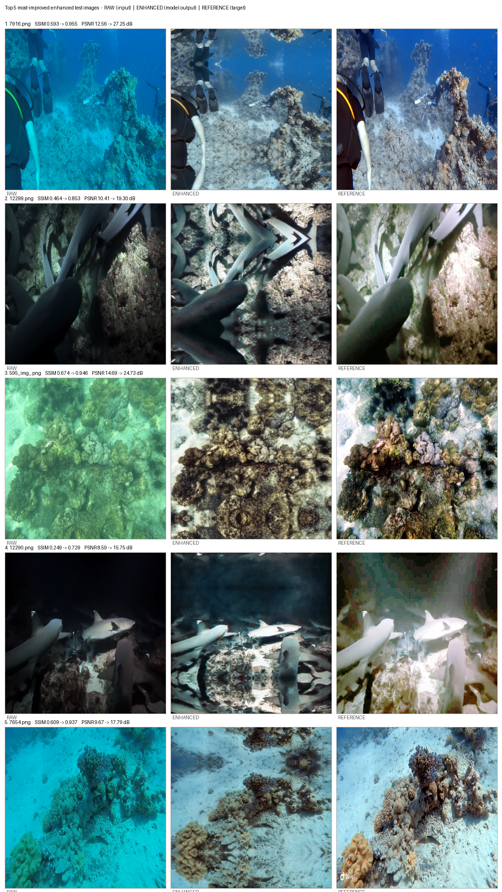
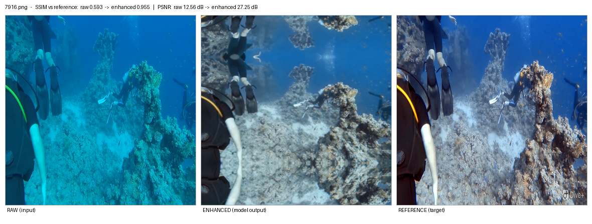
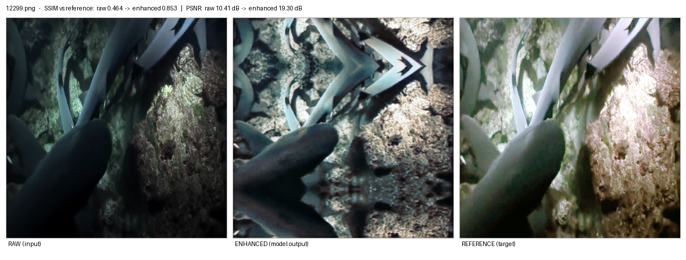
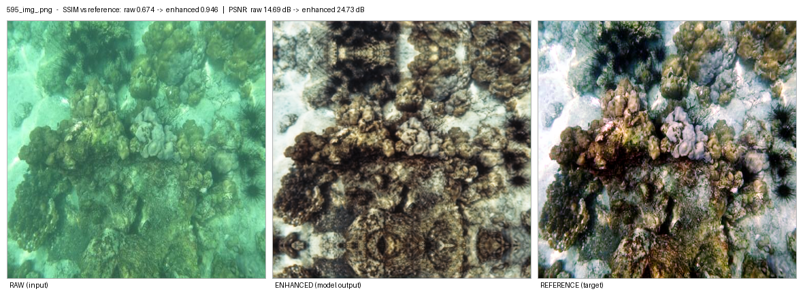
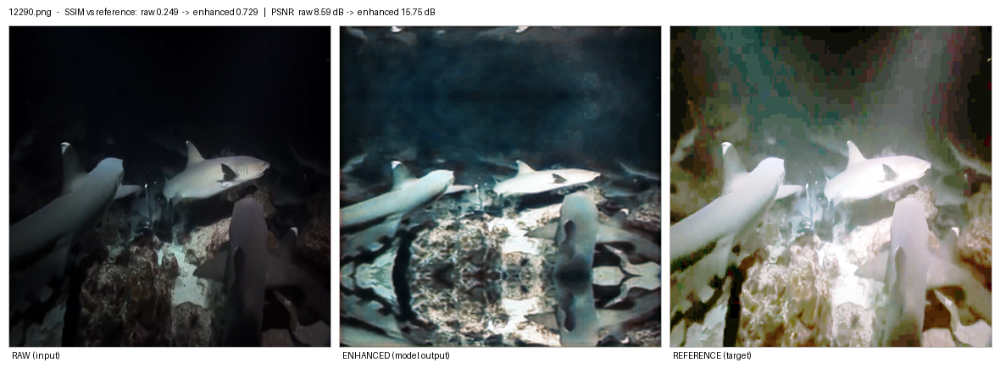
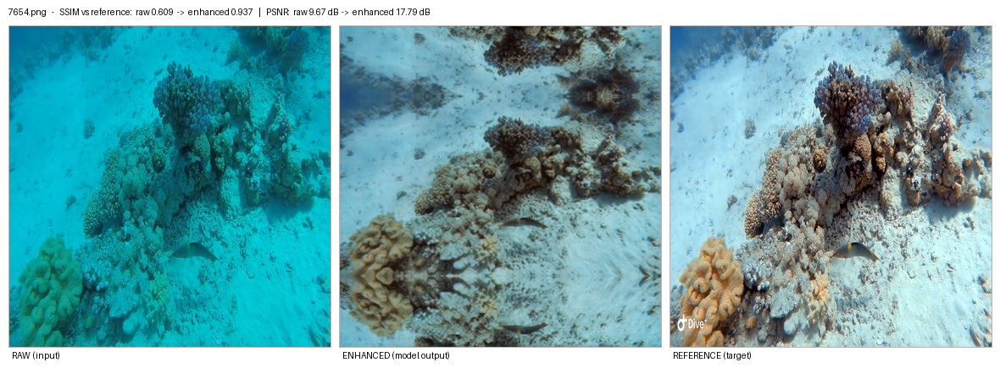

# Top 5 Most-Improved Test Images — RAW vs REFERENCE vs ENHANCED

Visual + numeric comparison of the five test images that gained the most from
`enhancement_model.py` (feature-guided underwater image enhancement).

Each image below is shown as a three-panel strip:

| Panel | Source |
|---|---|
| **RAW (input)** | `dataset/raw-890/<name>` — what the model was given |
| **ENHANCED (model output)** | `enhancement_results/enhanced_test_images/<name>` — 256×256 output |
| **REFERENCE (target)** | `dataset/reference-890/<name>` — the target the model was trained to match |

---

## Summary table

Reference = the target image. "Gain" is the improvement of the enhanced output over the raw
input when both are compared to the reference, using the same 256×256 reflect-pad
preprocessing as the model. SSIM/PSNR for the enhanced images match
`enhancement_results/enhancement_test_metrics.csv`.

| # | Image | SSIM raw → enhanced | SSIM gain | PSNR raw → enhanced (dB) | PSNR gain | Contrast | Entropy | Saturation |
|---|-------|---------------------|-----------|--------------------------|-----------|----------|---------|------------|
| 1 | `7916.png` | 0.593 → **0.955** | **+0.362** | 12.56 → **27.25** | **+14.69** | 21.8 → 45.6 | 6.26 → 7.25 | 252 → 103 |
| 2 | `12299.png` | 0.464 → **0.853** | **+0.389** | 10.41 → 19.30 | +8.89 | 37.1 → 62.5 | 6.68 → 7.71 | 78 → 54 |
| 3 | `595_img_.png` | 0.674 → **0.946** | +0.272 | 14.69 → 24.73 | +10.04 | 32.7 → 60.5 | 6.95 → 7.77 | 109 → 51 |
| 4 | `12290.png` | 0.249 → **0.729** | **+0.480** (largest) | 8.59 → 15.75 | +7.16 | 31.4 → 60.4 | 5.76 → 7.36 | 101 → 86 |
| 5 | `7654.png` | 0.609 → **0.937** | +0.328 | 9.67 → 17.79 | +8.12 | 26.1 → 45.5 | 6.50 → 7.29 | 246 → 75 |

Repo-wide context (all 134 test images): mean SSIM vs reference **0.772 → 0.886**,
mean PSNR **17.63 → 21.32 dB**; 109/134 images improved in SSIM, 112/134 in PSNR.

---

## 1. `7916.png` — best overall

Deep blue/cyan cast is removed (red-to-blue mean ratio 0.02 → 0.73), contrast roughly
doubles (21.8 → 45.6) and the reef, diver and the second diver on the right become clearly
visible. This is the closest match to the reference of the whole test set
(SSIM 0.955, PSNR 27.25 dB).

## 2. `12299.png` — darkest scene recovered

A near-black shark/reef frame. Illumination and local detail are restored, the shark bodies
get clean edges and the substrate texture reappears. Still slightly cooler/bluer than the
reference.

## 3. `595_img_.png` — worst haze, best colour balance

The heavy green water haze is stripped out, so coral structure and bright sand are clearly
separated (contrast 32.7 → 60.5, entropy → 7.77). Enhanced output is more neutral/greyer
than the colourful reference, but structure-wise it is a very strong match (SSIM 0.946).

## 4. `12290.png` — biggest relative jump

Largest SSIM gain of the set (+0.480) — an almost black scene where shark silhouettes,
bubbles and the rock floor become visible. Honest caveat: the enhanced result is still
darker and less saturated than the reference, so this is a *partial* enhancement, not a
full reconstruction.

## 5. `7654.png` — colour-cast removal from a bright scene

Strong turquoise/cyan cast removed (red-to-blue ratio 0.04 → 0.81), sand-versus-coral
separation restored. A faint checkerboard texture is visible in flat areas
(typical CNN/autoencoder artifact).

---

## Method / how these numbers were produced

* Both the raw input and the enhanced output were compared against the reference after the
  same preprocessing used by `enhancement_model.py`: aspect-preserving resize with
  `cv2.INTER_AREA` to 256 px on the long side, then reflect padding to 256×256.
* SSIM and PSNR use `skimage.metrics.structural_similarity` /
  `peak_signal_noise_ratio` with `data_range=255`, identical to the script, and reproduce
  `enhancement_results/enhancement_test_metrics.csv` exactly.
* Contrast = standard deviation of the grayscale image; entropy = Shannon entropy of the
  grayscale histogram; saturation = mean of the HSV S channel.

### Known weakness seen across the set

The model reliably fixes **contrast, illumination and colour cast**, but it tends to
**desaturate** — 24 of 134 outputs lost more than half their HSV saturation, and 13 lost
significant colourfulness, which is why several "enhanced" images look washed out next to
the vivid references.
